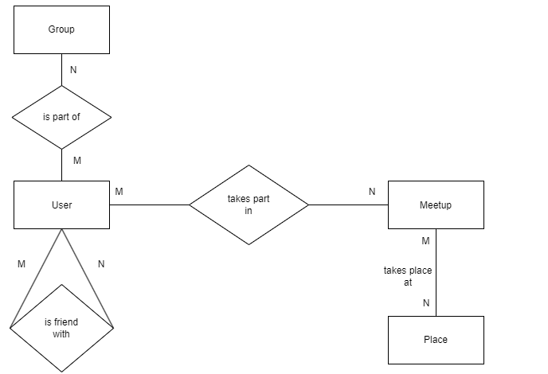

# Design Document

- By Mateusz Kaczyński

## Scope

The database for `Meetup` includes all tables necessary to facilitate
the process of creating new users and meetups, setting the hosts of the meetings 
and adding friend connections between users. As such, included in the database's scope is:

* Users, including basic identifying information
* Groups, including information about the name of the group and the creation group 
* User group connections, including the users who belong to a particular group
* Friend friend connections, including the ids of users who became friends
* Meetup places, including information about the meetup place
* Meetups, including the necessary information about the meeting and number of people attending
* People attending the meetup, which shows the ids of people attending a particular meeting

Out of scope are elements like paid meetups and other non-core attributes.

## Functional Requirements

This database will support:

* CRUD operations for users and hosts of the meetings
* Tracking all meetups taking place, people attending the meetups
* Adding connections between users and creating groups

## Representation
Entities are captured in MySQL tables with the following schema.

## Entities
The database includes the following entities:

### Users
The `users` table includes:
* `id`, which specifies the unique ID for the user as an `INT`. This column thus has the `PRIMARY KEY` constraint applied.
* `username`, which specifies the user's username as `VARCHAR(20)`, given `VARCHAR` is appropriate for text fields. A `UNIQUE` constraint ensures that two different users have the same username.
* `password`, which specifies the user's password. `VARCHAR(20)` is used for the same reason as `username`.
* `first_name`, which specifies the user's first name as `VARCHAR(20)`.
* `last_name`, which specifies the user's first name as `VARCHAR(20)`
* `birthdate`, which specifies the user's birthdate. `DATE` is used, because dates can be conveniently stored as YYYY-MM-DD. 
* `email`, which specifies the user's email as `VARCHAR(40)`.
* `phone_no`, which specifies the user's phone number as `VARCHAR(20)`.

### Groups
The `groups` table includes:
* `id`, which specifies the unique ID for the `groups` as an `INT`. This column thus has the `PRIMARY KEY` constraint applied.
* `name`, which specifies the group's name as `VARCHAR(20)`, given `VARCHAR` is appropriate for text fields. 
* `creation_date`, which specifies the group's creation date. `DATE` is used, because dates can be conveniently stored as YYYY-MM-DD.

### Users in groups
The `users in groups` table includes:
* `id`, which specifies the unique ID for the users in groups entry as an `INT`. This column thus has the `PRIMARY KEY` constraint applied.
* `group_id`, which specifies the ID of the group, which is referenced, as an `INT`. This column thus has the `FOREIGN KEY` constraint applied, referencing the `id` column in the `groups` table, which ensures that users can be referenced back to the group.
* `user_id`, which specifies the ID of the user, who belongs to a particular group, as an `INTEGER`. This column thus has the `FOREIGN KEY` constraint applied, referencing the `id` column in the `users` table, which ensures that groups can be referenced back to particular users.

ON DELETE CASCADE ensures that the entries from `Users in groups` table associated with particular group_id or user_id, that have been deleted from respective columns, will be deleted from `users in groups`.

### Friend-friend connections
The `friend-friend connections` table includes:
* `id`, which specifies the unique ID for the friend-friend connections entry as an `INT`. This column thus has the `PRIMARY KEY` constraint applied.
* `user1_id`, which specifies the ID of the user, who is in contact with another user, as an `INTEGER`. This column thus has the `FOREIGN KEY` constraint applied, referencing the `id` column in the `users` table.
* `user2_id`, which specifies the ID of the user, who is in contact with another user, as an `INTEGER`. This column thus has the `FOREIGN KEY` constraint applied, referencing the `id` column in the `users` table.

ON DELETE CASCADE ensures that the entries from `Friend-friend connections` table associated with particular user_ids, that have been deleted from `users` table, will be deleted from `friend friend connections`.

### Meetup places
The `meetup places` table includes:
* `id`, which specifies the unique ID for the meetup places entry as an `INT`. This column thus has the `PRIMARY KEY` constraint applied.
* `country`, which specifies the country, where the meetup is taking place as `VARCHAR(20)`, given `VARCHAR` is appropriate for text fields.
* `postcode`, which specifies the postcode of the place, where the meetup is taking place, as `VARCHAR(10)`, because postcodes are usually shorter or equal than 10 and using `VARCHAR` ensures that we can use postcodes that are a combination of numbers and letters or that require any special symbols.
* `city`, which specifies the city, where the meetup is taking place as `VARCHAR(30)`, given `VARCHAR` is appropriate for text fields.
* `place`, which specifies the place, where the event is going to be held as `VARCHAR(50)`.

### Meetups
The `meetups` table includes:
* `id`, which specifies the unique ID for the meetups entry as an `INT`. This column thus has the `PRIMARY KEY` constraint applied.
* `meetup_place_id`, which specifies the ID of the place, where the meetup is taking place, as `INT`. This column thus has the `FOREIGN KEY` constraint applied, referencing the `id` column in the `meetup places` table.
* `host_id`, which specifies the ID of the user, who is hosting the event, as `INT`. This column thus has the `FOREIGN KEY` constraint applied, referencing the `id` column in the `users` table.
* `meetup_date`, which specifies the meetup's date. `DATETIME` is used, because dates can be conveniently stored in the format YYYY-MM-DD hh:mm:ss.
* `meetup_name`, which specifies the name of the meetup as `VARCHAR(80)`, given `VARCHAR` is appropriate for text fields. 
* `people_attending`, which specifies the number of people attending, as `SMALLINT`, given that the meetups are unlikely to reach the limit set by smallint (32767). Constraint check (number >= 0) has been implemented on `people_attending` table.

### People in the meetup
The `people in the meetup` table includes:
* `id`, which specifies the unique ID for the people in the meetup entry as an `INT`. This column thus has the `PRIMARY KEY` constraint applied.
* `meetup_id`, which specifies the ID of a particular meetup as an `INT`. This column thus has the `FOREIGN KEY` constraint applied, referencing the `id` column in the `meetups` table.
* `user1_id`, which specifies the ID of a particular user as an `INT`. This column thus has the `FOREIGN KEY` constraint applied, referencing the `id` column in the `users` table.

Procedures `remove_person_from_meetup` and `add_person_to_meetup` have been created that increase or decrease the number of `people_attending` in `Meetups` and add or delete the entry in the table `people_in_the_meetup` accordingly to the procedure taken.

### Relationships

The below entity relationship diagram describes the relationships among the most important entities in the database.

As detailed by the diagram:
* A user belongs to 0 to many groups, 0 if user just created an account and didn't join any groups and 1 to many if he has already done that. A group has 0 to many users, 0 when it's just been created and many after some users joined. 
* A user attends 0 to many meetups. 0 if he hasn't joined any or if he doesn't host any and many if he's already enrolled in a few. A meetup has 1 to many users. 1 when there is just the host and many, when others joined the group.
* A user might have 0 to many friends.
* A meetup takes place at only one meeting place. One meetup place might be used in multiple meetups.

## Optimizations

Per the typical queries in `queries.sql`, it is common to search for a meetup taking place on a particular day or in a particular city or country. For that reason, indexes are created on `meetup_date`, `country` and `city` columns to increase the speed of queries run on the database.
Similarly, it is also common practice for a user or the database administrator to view events taking place in the current year or to see all events taking place. As such, views such as `all_events` and `events_from_2024` were created.

## Limitations

To avoid redundancy, further normalization might be needed. For example, country from meetup_places table could be created as a separate table. 
Moreover, the current design does not support creating meetup events hosted by multiple hosts and does not support setting the founder for a particular group.